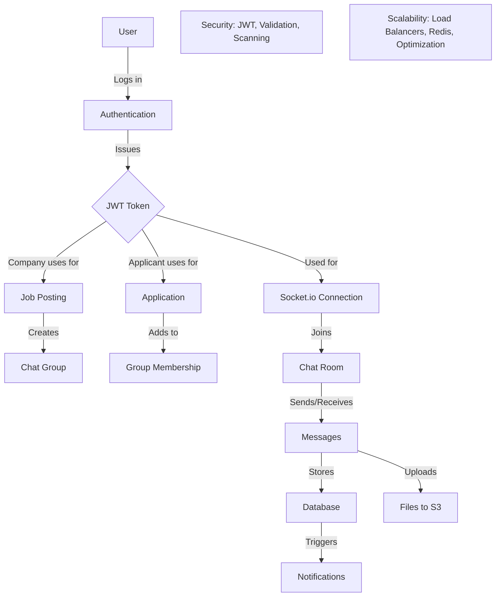
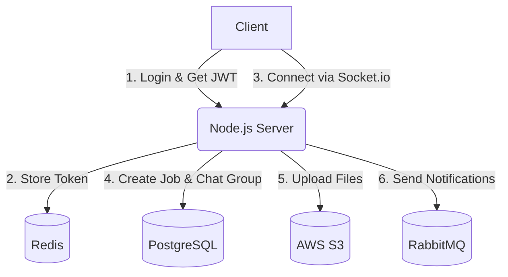
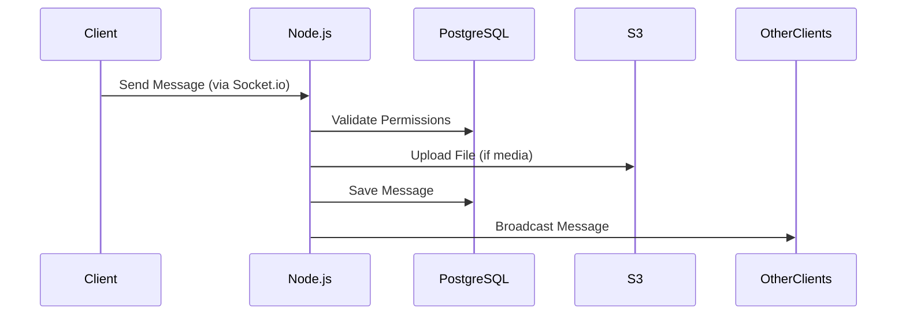
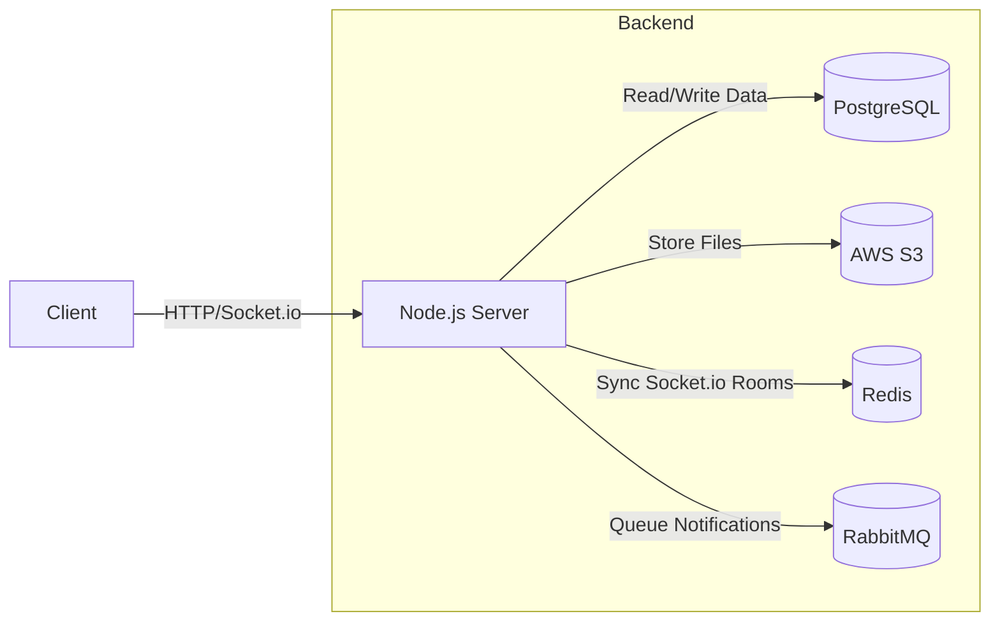
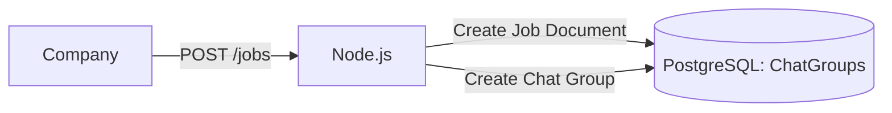
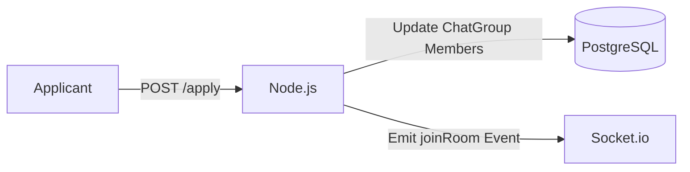
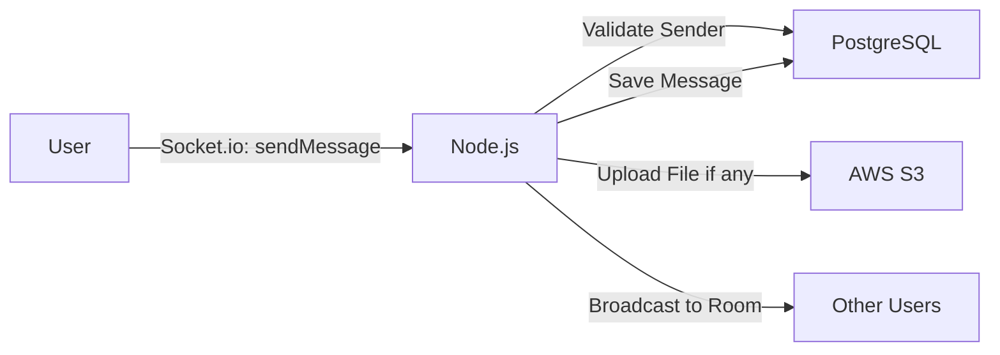
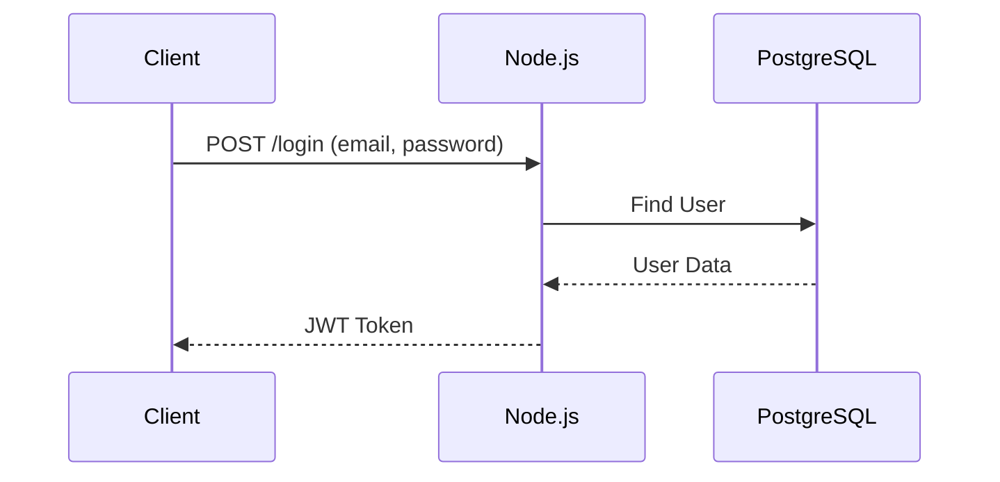
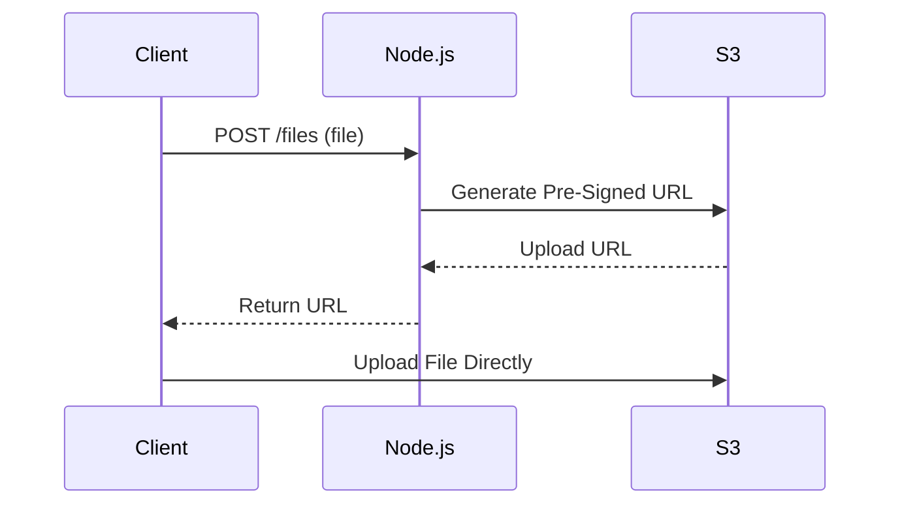
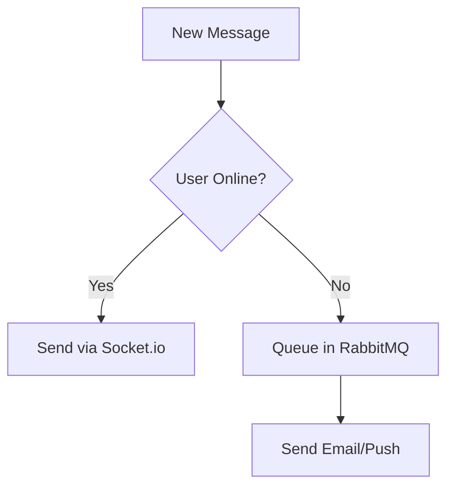

# slay-e-chatapp-backend




Here’s a simplified explanation using **Mermaid.js** syntax for diagrams. You can render these diagrams in tools like [Mermaid Live Editor](https://mermaid-js.github.io/mermaid-live-editor/) or VS Code with a Mermaid plugin.

---

## **Simplified Architecture**  
### **System Flow**  


---

## **Real-Time Messaging Sequence**  


---

## **Component Interactions**  


---

## **Simplified Data Flow Explanation**  

### **1. Authentication**  
- **Client**: Logs in via REST API to get a JWT.  
- **Server**: Validates credentials, returns JWT.  
- **Socket.io**: Uses JWT to authenticate real-time connections.  

### **2. Job Creation**  


### **3. Applicant Joins Chat**  


### **4. Sending a Message**  


---

## **Key Mermaid Diagrams Explained**  

### **1. Authentication Flow**  


### **2. File Upload Flow**  


### **3. Notification System**  


---

## **How to Use These Diagrams**  
1. Copy the Mermaid code blocks.  
2. Paste them into the [Mermaid Live Editor](https://mermaid-js.github.io/mermaid-live-editor/).  
3. Render to visualize the flow.  

---

Here’s a simplified breakdown of the system’s data flow and architecture, using **text-based diagrams** and straightforward explanations. For graphical clarity, tools like [Draw.io](https://app.diagrams.net/) or [Excalidraw](https://excalidraw.com/) can visualize this flow.

---

## **Simplified Data Flow**  
### **Step 1: Authentication**  
```
[Client] → (Login API) → [JWT Token] → [Socket.io Connection]  
```  
- **What’s Happening**:  
  - Users (companies/applicants) log in via REST API to get a JWT token.  
  - The token is used to authenticate real-time Socket.io connections.  

---

### **Step 2: Job Creation & Chat Group Setup**  
```
Company → (Create Job API) → [Server] → [Database: Job + ChatGroup]  
```  
- **What’s Happening**:  
  - A company posts a job.  
  - The backend **automatically creates a chat group** linked to the job.  
  - The company user is added as the group admin.  

---

### **Step 3: Applicant Applies & Joins Chat**  
```
Applicant → (Apply to Job API) → [Server] → [Add to ChatGroup] → [Socket.io: joinRoom Event]  
```  
- **What’s Happening**:  
  - When an applicant applies, they’re added to the job’s chat group.  
  - The server triggers a Socket.io `joinRoom` event to add them to the real-time chat room.  

---

### **Step 4: Real-Time Messaging**  
```
User → (Send Message) → [Socket.io] → [Save to DB] → [Broadcast to Room]  
```  
- **What’s Happening**:  
  - Messages are sent via Socket.io, saved to the database, and broadcast to all users in the chat room.  
  - Files (images/docs) are uploaded to AWS S3 first, and their URLs are sent as messages.  

---

### **Step 5: Notifications**  
```
[Socket.io] → (Online Users)  
[Message Queue] → (Offline Users) → [Email/Push Notifications]  
```  
- **What’s Happening**:  
  - Online users receive messages instantly via Socket.io.  
  - Offline users get notifications via email/push using a message queue (e.g., RabbitMQ).  

---

## **System Diagram (Simplified)**  
```  
                       +-----------------+
                       |     Client      |
                       | (Web/Mobile App)|
                       +--------+--------+
                                |
                                | HTTP/Socket.io
                                |
                  +-------------v-------------+
                  |   Load Balancer (NGINX)  |
                  +-------------+-------------+
                                |
                                | Distributed Traffic
                                |
                  +-------------v-------------+
                  |   Node.js Servers        |
                  | (Express.js + Socket.io) |
                  +-------------+-------------+
                                |
                                | Redis (Pub/Sub)
                                |
+-----------------+    +--------v--------+    +-----------------+
|   PostgreSQL       |    |   AWS S3       |    |   RabbitMQ      |
| (Jobs, Chats,   <----+ (File Storage) +----> (Notifications) |
|  Messages)      |    +-----------------+    +-----------------+
+-----------------+  
```  

---

## **Key Components Explained**  
1. **Client**:  
   - **Companies**: Post jobs, manage chats.  
   - **Applicants**: Apply to jobs, send messages.  
   - **Real-Time Updates**: Messages appear instantly via Socket.io.  

2. **Node.js Servers**:  
   - Handle REST APIs (job creation, applications).  
   - Manage Socket.io rooms for real-time chat.  

3. **PostgreSQL**:  
   - Stores jobs, chat groups, messages, and user data.  
   - Example query: `Find all messages where chatGroupId = XYZ`.  

4. **AWS S3**:  
   - Stores files (images, resumes) securely.  
   - Returns URLs like `https://s3.amazonaws.com/job-chats/file.pdf`.  

5. **Redis**:  
   - Syncs Socket.io rooms across multiple Node.js servers.  
   - Ensures messages reach all users, even in a scaled setup.  

6. **RabbitMQ**:  
   - Queues notifications for offline users (e.g., "New message in Job Chat!").  

---

## **Example Scenario: Sending a Message**  
```  
Applicant (Client)           Node.js Server               PostgreSQL                Other Clients  
      | → "Hello Team!"           |                           |                        |  
      |                           | → Validate Permissions    |                        |  
      |                           | → Save to Messages        |                        |  
      |                           | → Broadcast via Socket.io |                        |  
      | ← "Message Received"      |                           |                        | ← "Hello Team!"  
```  

1. The applicant sends a message.  
2. The server checks if they’re part of the chat group.  
3. The message is saved to PostgreSQL.  
4. Socket.io broadcasts it to all users in the room.  

---

## **Security Simplified**  
- **JWT Tokens**: Verify users on every Socket.io message.  
- **File Scanning**: AWS Lambda scans uploaded files for malware.  
- **Rate Limiting**: Block users sending too many messages (e.g., 100/min).  

---

## **Summary**  
- **Companies** create jobs → **Chat groups auto-generated**.  
- **Applicants** apply → **Auto-join chats** → **Send messages/files**.  
- **Real-time updates** via Socket.io + **Notifications** for offline users.  
- **Scalable** with Redis/NGINX and secure with JWT/S3.
# slay-e-chatapp-backend


Here’s a simplified explanation using **Mermaid.js** syntax for diagrams. You can render these diagrams in tools like [Mermaid Live Editor](https://mermaid-js.github.io/mermaid-live-editor/) or VS Code with a Mermaid plugin.

---

## **Simplified Architecture**  
### **System Flow**  


---

## **Real-Time Messaging Sequence**  


---

## **Component Interactions**  


---

## **Simplified Data Flow Explanation**  

### **1. Authentication**  
- **Client**: Logs in via REST API to get a JWT.  
- **Server**: Validates credentials, returns JWT.  
- **Socket.io**: Uses JWT to authenticate real-time connections.  

### **2. Job Creation**  


### **3. Applicant Joins Chat**  


### **4. Sending a Message**  


---

## **Key Mermaid Diagrams Explained**  

### **1. Authentication Flow**  


### **2. File Upload Flow**  


### **3. Notification System**  


---

## **How to Use These Diagrams**  
1. Copy the Mermaid code blocks.  
2. Paste them into the [Mermaid Live Editor](https://mermaid-js.github.io/mermaid-live-editor/).  
3. Render to visualize the flow.  

---

Here’s a simplified breakdown of the system’s data flow and architecture, using **text-based diagrams** and straightforward explanations. For graphical clarity, tools like [Draw.io](https://app.diagrams.net/) or [Excalidraw](https://excalidraw.com/) can visualize this flow.

---

## **Simplified Data Flow**  
### **Step 1: Authentication**  
```
[Client] → (Login API) → [JWT Token] → [Socket.io Connection]  
```  
- **What’s Happening**:  
  - Users (companies/applicants) log in via REST API to get a JWT token.  
  - The token is used to authenticate real-time Socket.io connections.  

---

### **Step 2: Job Creation & Chat Group Setup**  
```
Company → (Create Job API) → [Server] → [Database: Job + ChatGroup]  
```  
- **What’s Happening**:  
  - A company posts a job.  
  - The backend **automatically creates a chat group** linked to the job.  
  - The company user is added as the group admin.  

---

### **Step 3: Applicant Applies & Joins Chat**  
```
Applicant → (Apply to Job API) → [Server] → [Add to ChatGroup] → [Socket.io: joinRoom Event]  
```  
- **What’s Happening**:  
  - When an applicant applies, they’re added to the job’s chat group.  
  - The server triggers a Socket.io `joinRoom` event to add them to the real-time chat room.  

---

### **Step 4: Real-Time Messaging**  
```
User → (Send Message) → [Socket.io] → [Save to DB] → [Broadcast to Room]  
```  
- **What’s Happening**:  
  - Messages are sent via Socket.io, saved to the database, and broadcast to all users in the chat room.  
  - Files (images/docs) are uploaded to AWS S3 first, and their URLs are sent as messages.  

---

### **Step 5: Notifications**  
```
[Socket.io] → (Online Users)  
[Message Queue] → (Offline Users) → [Email/Push Notifications]  
```  
- **What’s Happening**:  
  - Online users receive messages instantly via Socket.io.  
  - Offline users get notifications via email/push using a message queue (e.g., RabbitMQ).  

---

## **System Diagram (Simplified)**  
```  
                       +-----------------+
                       |     Client      |
                       | (Web/Mobile App)|
                       +--------+--------+
                                |
                                | HTTP/Socket.io
                                |
                  +-------------v-------------+
                  |   Load Balancer (NGINX)  |
                  +-------------+-------------+
                                |
                                | Distributed Traffic
                                |
                  +-------------v-------------+
                  |   Node.js Servers        |
                  | (Express.js + Socket.io) |
                  +-------------+-------------+
                                |
                                | Redis (Pub/Sub)
                                |
+-----------------+    +--------v--------+    +-----------------+
|   PostgreSQL       |    |   AWS S3       |    |   RabbitMQ      |
| (Jobs, Chats,   <----+ (File Storage) +----> (Notifications) |
|  Messages)      |    +-----------------+    +-----------------+
+-----------------+  
```  

---

## **Key Components Explained**  
1. **Client**:  
   - **Companies**: Post jobs, manage chats.  
   - **Applicants**: Apply to jobs, send messages.  
   - **Real-Time Updates**: Messages appear instantly via Socket.io.  

2. **Node.js Servers**:  
   - Handle REST APIs (job creation, applications).  
   - Manage Socket.io rooms for real-time chat.  

3. **PostgreSQL**:  
   - Stores jobs, chat groups, messages, and user data.  
   - Example query: `Find all messages where chatGroupId = XYZ`.  

4. **AWS S3**:  
   - Stores files (images, resumes) securely.  
   - Returns URLs like `https://s3.amazonaws.com/job-chats/file.pdf`.  

5. **Redis**:  
   - Syncs Socket.io rooms across multiple Node.js servers.  
   - Ensures messages reach all users, even in a scaled setup.  

6. **RabbitMQ**:  
   - Queues notifications for offline users (e.g., "New message in Job Chat!").  

---

## **Example Scenario: Sending a Message**  
```  
Applicant (Client)           Node.js Server               PostgreSQL                Other Clients  
      | → "Hello Team!"           |                           |                        |  
      |                           | → Validate Permissions    |                        |  
      |                           | → Save to Messages        |                        |  
      |                           | → Broadcast via Socket.io |                        |  
      | ← "Message Received"      |                           |                        | ← "Hello Team!"  
```  

1. The applicant sends a message.  
2. The server checks if they’re part of the chat group.  
3. The message is saved to PostgreSQL.  
4. Socket.io broadcasts it to all users in the room.  

---

## **Security Simplified**  
- **JWT Tokens**: Verify users on every Socket.io message.  
- **File Scanning**: AWS Lambda scans uploaded files for malware.  
- **Rate Limiting**: Block users sending too many messages (e.g., 100/min).  

---

## **Summary**  
- **Companies** create jobs → **Chat groups auto-generated**.  
- **Applicants** apply → **Auto-join chats** → **Send messages/files**.  
- **Real-time updates** via Socket.io + **Notifications** for offline users.  
- **Scalable** with Redis/NGINX and secure with JWT/S3.
